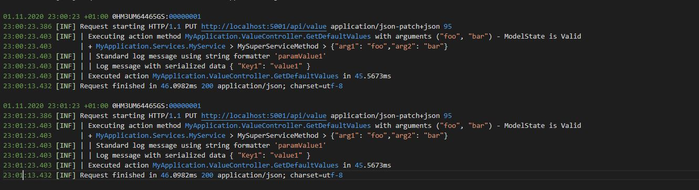

# .NET Core Logging Provider

Logging provider enriching [Microsoft.Extensions.Logging](https://www.nuget.org/packages/Microsoft.Extensions.Loggin) by aggregated HTTP request logging. 
Supports multiple file writers for grouping by requests, priorities, service calls or processes. Contains adapter for notification sending.

Register logger services by `AddRequestLogger`:
```
public class Program
{
    public static void Main(string[] args)
    {
        CreateWebHostBuilder(args).Build().Run();
    }

    public static IHostBuilder CreateWebHostBuilder(string[] args)
    {
        return Host.CreateDefaultBuilder(args)
            .ConfigureLogging(loggingBuilder =>
            {
                // Log HTTP requests in files by actual date
                loggingBuilder.AddRequestLogger();
            })
            .ConfigureWebHostDefaults(webBuilder => { webBuilder.UseStartup<Startup>(); });
    }
}
```

and provide logging options in your `appsettings.json` file:
```
{
  "Logging": {
    "LogLevel": {
      "Default": "Warning", // Define standard log filtering 
      "MyApp": "Information", // Log all informations from our application (includes nested namespaces like MyApp.Libs...)
      "Microsoft.AspNetCore.Hosting.Diagnostics": "Information" // Log HTTP requests
    },
    "Pipaslot": {
      "OutputPath": "./logs",
      "IncludeScopes": false, // Log scopes created by ILogger<>.BeginScope()
      "IncludeMethods": true  // Log method calls created by ILogger<>.BeginMethod()
    }
  }
}
```

## Example
Boost your logging abilities by logging class and method names, visualize deep of nesting and log serialized data/structures
Create custom controller and service, setup logging and check your log file after few requests
```
public class ValueController
{
    private readonly MyService _service;
    public ValueController(MyService service)
    {
        _service = service;
    }

    public ActionResult GetDefaultValues(string arg1, int arg2)
    {
        // ... do something around
        return _service.MySuperServiceMethod(arg1, arg2);
    }
}

public class MyService
{
    private readonly ILogger<MyClass> _logger;
    public Service(ILogger<MyClass> logger)
    {
        _logger = logger;
    }

    public string MySuperServiceMethod(string arg1, int arg2)
    {
        // Log class full name and invoked method name with some additional data as method scope
        using(_logger.BeginMethod(new{ arg1, arg2}))
        {
            // ... do something ...

            // Log message as you are used to from standar logger
            _logger.LogInformation("Standard log message using string formatter '{0}'", "paramValue1");   

            // Or provide enhanced message with data dump as json
            _logger.LogInformationWithData("Log message with serialized data", new { Key1 = "value1" ... });  

            return ...
        }
    }
}
```

and check your log file:



## Aggregate only errors or critical messages into separated log file
Register `loggingBuilder.AddFlatLogger("-errors", LogLevel.Error);` to extract only messages with priority Error and higher (includes Critical) to file with suffix "-errors"
## Log single or multiple class usages into separated log file
Register `loggingBuilder.AddTreeLogger("-services", "MyApplication.Services");`. All messages and scopes in classes within this namespace will be logged into separated file with suffix "-service".

## Send notification with critical error dump
Register `loggingBuilder.AddSendLogger<MyMailLogSender>(LogLevel.Critical);` and provide class `MyMailLogSender` implementing interface `Pipaslot.Logging.ILogSender`. 
All critical errors will be sent through your sender.

## Log Background worker threads
If you need to log what is happening in thread not related to HTTP request, you can use registration for process logger: `loggingBuilder.AddProcessLogger();`
